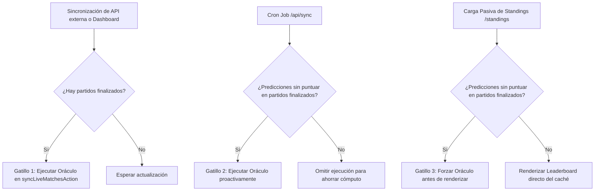

# Funcionamiento del Oráculo de Puntuaciones (MundiApp26)

Este documento detalla el diseño técnico, el flujo de ejecución y los mecanismos de automatización pasiva implementados en el Oráculo para garantizar la sincronización en tiempo real y la resiliencia offline de las clasificaciones de la liga y los puntos de quiniela.

---

## 1. Arquitectura y Mapeo de Datos

El sistema opera bajo un esquema de traducción bidireccional entre la base de datos distribuida en vivo (Supabase) y el estado local de la aplicación (JSON):

| Fuente de Información | Campo Goles Local | Campo Goles Visitante | Estado del Partido |
| :--- | :--- | :--- | :--- |
| **Supabase (`match_results`)** | `home_score` | `away_score` | `status = 'finished'` |
| **JSON Local (`world-cup-2026.json`)** | `goles_local` | `goles_visitante` | `estado = 'finalizado'` |

### Flujo de Traducción en el Oráculo

Cuando el Oráculo entra en acción:

1. Consulta los partidos con `status = 'finished'` en la base de datos de Supabase.
2. Traduce cada registro al formato en español esperado por el frontend de la aplicación.
3. Actualiza y persiste estos datos en el JSON local (`world-cup-2026.json`) si se encuentra en entorno de desarrollo.
4. Calcula los puntos de predicciones usando la función pura `calculatePoints()`.
5. Ejecuta un `upsert` bulk para inyectar los puntos calculados en la tabla `predictions` en Supabase.
6. Recalcula el acumulado de puntos de los miembros de la liga (`league_members`) y actualiza sus victorias en duelos.

---

## 2. Mecanismo de Sincronización y Automatización Híbrida

Para evitar que los puntos queden desactualizados y eliminar la dependencia exclusiva de intervenciones manuales del administrador o de la fiabilidad de cron jobs externos, se ha diseñado una **Estrategia de Automatización Híbrida de 3 Capas**:

### Capa 1: Gatillado por Evento en Sincronización (`syncLiveMatchesAction`)

Cada vez que el backend o un usuario a través del Dashboard gatille la Server Action de sincronización (`syncLiveMatchesAction` en `sync.ts`) y se registren marcadores desde la API de deportes, se invoca automáticamente al oráculo si se detectan partidos modificados.

### Capa 2: Gatillado Proactivo por Cron Job (`/api/sync`)

El endpoint dinámico ejecutado por el planificador (Cron) valida si existe **al menos una predicción** con `points_earned IS NULL` para cualquier partido que ya figure como `finished`. Si se detecta alguna, se dispara el Oráculo inmediatamente. Esto corrige de forma automática cualquier desfase o retraso en la recepción de la sincronización de la API de deportes.

### Capa 3: Validación Pasiva en Tiempo de Renderizado (`StandingsPage`)

Al cargar la página de clasificaciones de la Liga (Server Component `StandingsPage`), el servidor realiza una validación rápida y ultra eficiente: comprueba si existen predicciones sin puntuar para los partidos terminados en Supabase.

* **Si hay pendientes:** Ejecuta el oráculo de forma transparente antes de realizar la consulta de los miembros de la liga. El usuario regular ve sus puntos actualizados al instante sin requerir acción de un admin.
* **Si no hay pendientes:** Salta el paso del oráculo, sirviendo los datos del leaderboard de forma inmediata (desempeño sub-100ms).

---

## 3. Lógica de Puntuación (El Oráculo)

La función pura `calculatePoints()` evalúa las predicciones frente a los marcadores reales de acuerdo a las siguientes reglas oficiales del torneo:

* **Tendencia Correcta (+2 puntos):** Acertar al ganador del partido (local/visitante) o acertar el empate.
* **Marcador Exacto (+3 puntos extra):** Acertar exactamente la cantidad de goles de ambos equipos.
* **Puntuación Máxima (5 puntos):** Acertar tendencia + marcador exacto (Pleno).

---

## 4. Historial de Correcciones y Lecciones Aprendidas

1. **Problema de la Ventana Temporal de 3 minutos:** Anteriormente, el oráculo dependía de que el partido hubiera finalizado en una ventana estricta de 3 minutos para gatillarse, lo cual fallaba ante cualquier retraso de red. Se reemplazó por la validación semántica de datos pendientes (`points_earned IS NULL`).
2. **Desactualización Pasiva en Standings:** La página de posiciones se apoyaba en una acción manual del administrador. Al agregar la tercera capa en Standings Server Page, se garantiza que los puntos se refresquen para todos los usuarios en cada render sin sobrecargar el servidor.
